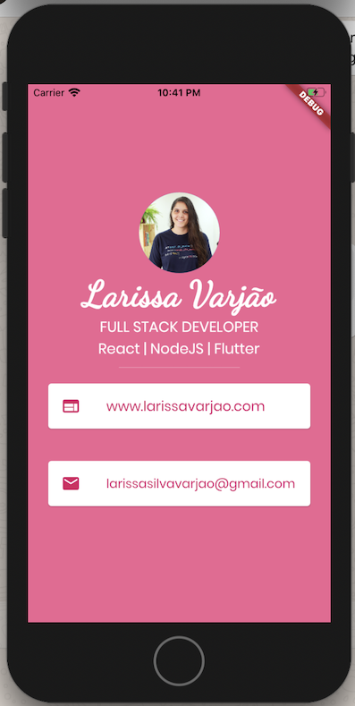

# Flutter Portfolio

This is an app to practice flutter and have a card with my website and email.

# How to run

```shell
cd flutter-card/
flutter run

```

Or do Fn + F5 if you're on mac notebook

# Final Result

You can see on my app that I'm a software developer with experience in React, NodeJs and Flutter. With my information, as showed bellow:

View of the app


## Technologies

- Flutter
- Google Fonts

# Made By

- [Linkedin](https://br.linkedin.com/in/larissa-varj%C3%A3o-152932b8)
- [Website](http://larissavarjao.com/)
